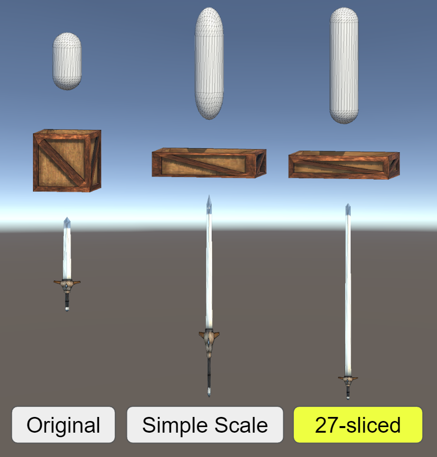
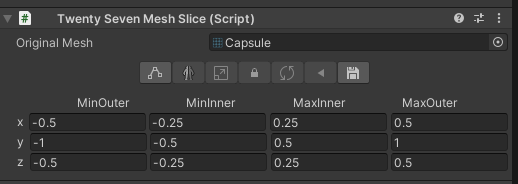

# TwentySevenMeshSlice

### What is this

- You can design how mesh scales without being distorted like sprite 9-slice.
- You can also change scales of perimeter 26 boxes.

### Limitations

- uv will not be repeated. Scaled only.

### Usage

Component looks like above.

#### SerializedField
- Original Mesh: Set a mesh to modify. When it is set, MeshFilter's mesh will swap to sliced mesh automatically.
- xyz: you can hit accurate value to set each bounding box size.

#### Toolbar Buttons
- Edit slice bounds: Change two boxes (Inner and Outer) to define how to scale mesh. 
- Mirror edit mode: Mirror control for boxes.
- Scale Mesh: Mesh scales along with each boxes size.
- Lock Inner-Outer box offset: Lock the offset of inner and outer box.
- Reset to original bounds: When messed up, press this to reset to original bounds.
- Rollback to original mesh: When messed up, press this to reset to original mesh.
- Save as prefab: GameObject's prefab will be created under selected folder with mesh as a SubAsset. (:warning: Creating prefab with Drag&Drop won't create mesh properly.)
